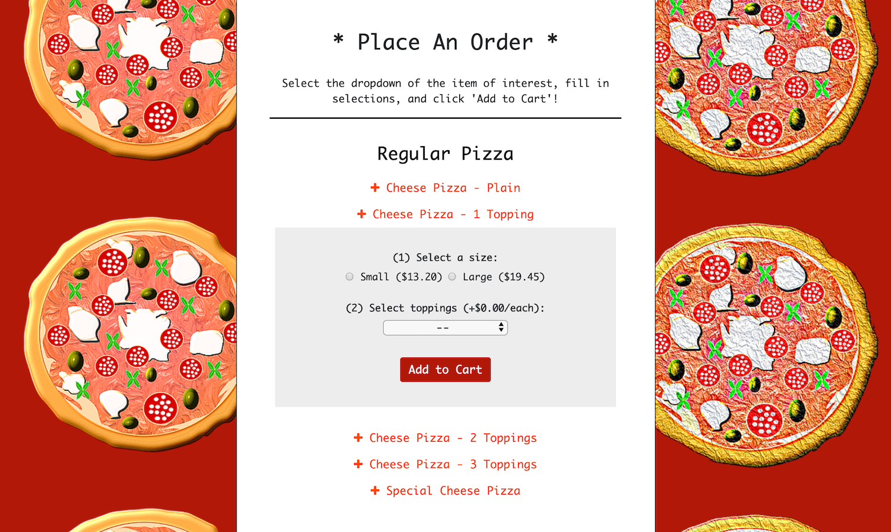

# Pinnochio's Pizza & Subs

## I. About

This project, _Pinnochio's Pizza & Subs_, is an interactive Django web application that surfaces the 
menu of an existing restaurant in Cambridge, Massachusetts and allows customer's to 
customize their order, add items to their cart and ultimately place food orders. Administrators
also have access to page that allows them to view all orders and their current statuses.

## II. User Navigation + Usage

All customers who attempt to access the _Pinnochio's Pizza & Subs_ website will first be 
asked to login with their credentials in the page captured below.

<p align="center">
  
</p>

If their credentials do not exist, a customer may register for an account by providing a username, 
name and email. If the username is already taken, the customer will be prompted to provide
another username. If the username is available, their account will be created and the user
will be redirected back to the login page to login.

Once the customer has been authenticated, they will be brought to the website's main landing page,
which surfaces all the items on the _Pinnochio's Pizza & Subs_ menu (shown below).

<p align="center">
  
</p>

Here, a customer may peruse the various menu item options and, if interested in a particular 
item, click on that item to view its customizations. Depending on the menu item, a customer 
may select (1) size and (2) toppings (see an example drop-down below). Note that the number of 
topping options for any given item is pre-defined by the _Pinnochio's Pizza & Subs_ admin
The dropdown of the menu item additionally surfaces the price for each item and for any added toppings.

<p align="center">
  
</p>

A customer may then add a customized item to their cart by clicking on the `Add to Cart` button, at which point the black
cart icon at the top of the screen will show `(1)`. As a customer adds other items to their cart, 
the cart icon will increment until an order is placed (the cart below shows 2 items). Customers may also view the contents on their cart
by clicking on this cart icon.

<p align="center">
  
</p>

Once satisfied with their selected items, customers may navigate again to the cart to review their items and
submit an order with their email. This email address is used to send an auto-generated
confirmation email to the customer that their order has been placed! This confirmation also includes the
order number (matching the database id for that order), in the case that they need to call _Pinnochio's_ about their order.


#### Administrators Only

For administrators of the site, an additional navigation bar is provided that, when clicked,
displays all orders currently in the database and their current status (hence, the `View All Orders`
 button shown in the images above are not visible to customers). Note additionally that statuses are limited 
to the following: 
* `In Cart`: a customer has added items, but not purchased them
* `In Progress`: an order is cooking
* `On it's Way`: an order is on-route to the customer
* `Delivered`: an order is delivered or picked-up by the user.

An example of this order page is shown below.

<p align="center">
  
</p>

Additionally, only administrators have access to editing the database through
the `/admin` endpoint of the web application, made available by Django (see more below). 
Any item in the database model (see more below) can be edited, created, and deleted from this admin interface.

## III. Website Components

### Django

This application uses Django, a high-level python framework for web development. Django facilitates
in (1) the creation of a database and migrations of the database model, (2) configuration of routes (3) templating of html
 pages (as above) and (4) sending emails to  website users, among other features. This Django project utilizes only one app, `orders`.

#### a. Database Model

The database model underlying this project can be found in `orders/database.py`. This model
includes the following model classes:
* `MenuSection()`: representing a single menu section (i.e., Subs)
* `Size()`: represents available sizes of items (i.e., small)
* `Topping()`: represents available toppings (i.e., onions)
* `Item()`: represents the an individual menu item name only, for model purposes
* `Price()`: represents a unique combination of price with size and item
* `MenuItem()`: represents a single item on the menu in its entirety, designed with available
customer options in mind
* `CustomerItem()`: a customized item created be a customer (i.e., small cheese pizza with onions costing $14.40)
* `Order()`: an order object representing all CustomerItems() in that order, capturing time of actions of that order.

The database was modeled off of the menu on the real _Pinnochio's Pizza & Subs_ website
found here: http://www.pinocchiospizza.net/menu.html. 

This project utilizes a sqlite relational database (the Django default) that was created using the code stored in 
`orders/build_database.py`. This file can be used to create each item in the database, with its correct relationships, 
in the case that the database needs to be regenerated again. Because the database, in it's current state, is quite small, it 
was committed as part of this project (see `db.sqlite3`).

If changes to the database model are necessary, see the section entitled `Develop`  under`IV. Usage Locally`  
for more information on database migrations. Additions, changes, and deletions to individual items in the database
can be accomplished by logging into the admin UI with a `superuser` login at the `/admin` endpoint of the webpage. 

#### b. Routes

Routes for the website are configured in this applications `orders/views.py` file, allowing
for users to login, logout, register, add items to cart, submit an order and view all orders (for administrators).
Urls for these routes can be found in the associated `orders/urls.py` file.

#### c. Settings

Settings for the project were updated from their default settings in the `pizza/settings.py` file.
In addition to adding the `orders` app to  `INSTALLED_APPS`, at the bottom of the page, changes were made to settings 
relevant for enabling the `orders` application to send emails. An email address was created on Google.com for this 
application to use in sending emails (`pinnochiopizzaandsubs@gmail.com`), with a password accessible via environmental 
variables (see `Setup` below).

### HTML + CSS

This application includes several HTML pages, each extending a single template, `orders/template.html`:
* `login.html`: surfaces the login page for the user
* `register.html`: surfaces ther registration page for the user
* `index.html`: surfaces the main menu page of the website
* `cart.html`: shows the customer cart 
* `all_order.html`: shows all orders ever placed for site administrators only.

Templating was accomplished using the Django html template language (see more on Django above).

All formatting for the website is controlled by a single stylesheet, found in
`orders/static/orders/styles.css`. Images and icons used in this website can similarly be found under `orders/static/img/`.


## IV. Usage Locally

In order to deploy _Pinnochio's Pizza & Subs_ locally, please follow the steps below.

### Setup 

#### 1. Create local python environment
Packages required for this project are outlined in `requirements.txt`. You may create a 
virtual environment with these requirements using the following commands:

(1) Create your virtual environment (venv):
```
$ pip install virtualenv
$ virtualenv venv
``` 

(2) Activate your venv:
```
$ source venv/bin/activate
```
(3) Install your requirements:
```
$ pip install -r requirements.txt
```

#### 2. Set environmental variables
Running this project locally requires configuring a single local environmental variable (`PIZZA_EMAIL_PASSWORD`)
that represents the password associated with the _Pinnochio's Pizza & Subs_ email account 
(`pinnochiopizzaandsubs@gmail.com`). This is required in order to send confirmation emails to customers. 

_Password hint_: pizza (all lowercase) + subs (all uppercase) + year that application was created

### Run

With the above steps completed, you may deploy the website locally and review it:
```
(venv) $ python manage.py runserver
```
Use the resulting url printed out by Django in any browser to see the website in action. 

### Develop

Use the following tips in making changes to this application.

#### a. Database migrations

To run database migrations, after making changes to the database model in `orders/models.py`, use the following commands:
```
(venv) $ python manage.py makemigrations
(venv) $ python migrate --run-syncdb
```
Confirm that migrations were successful by identifying a new file in the `orders/migrations` directory.

#### b. Create new administrator (`superuser`)

Administrators have access to the Django database UI for editing database items and the ability to view all orders 
from the website. Create a new administrator using the following command:

```
(venv) $ python manage.py createsuperuser
```

#### b. Tests

Django facilities testing by extending python's unittest testing framework. Tests for this application can
be run via:
```
(venv) $ python manage.py test
```

## V. Developer Notes 
This project was developed on a Macbook (macOS Mojave) and was primarily tested in
Safari and Chrome.

### Future Releases
Future releases of _Pinnochio's Pizza & Subs_ website will allow users to view their previous orders and
check on the status of their order, as well as include upgrades to the autogenerated email.


